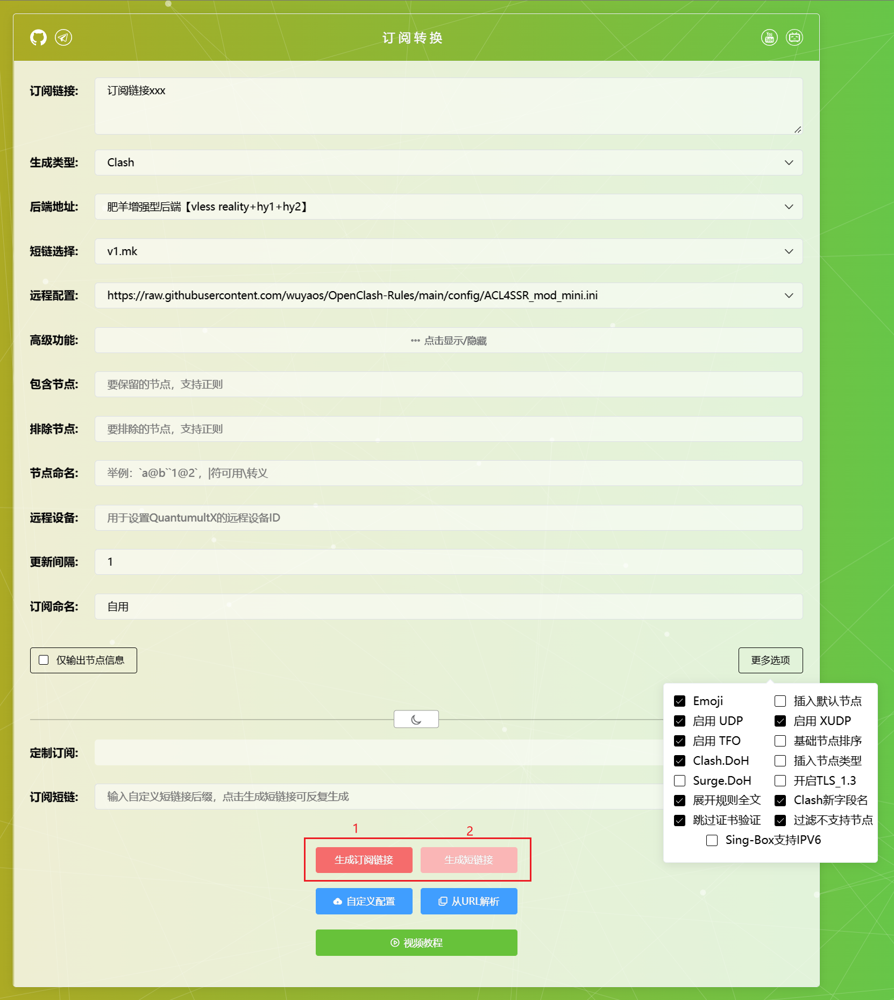

# OpenClash-Rules

# 订阅转换教程

***

## 快速使用

打开[肥羊订阅转换前端](https://suburl.v1.mk/)，填入必要信息（如图所示），用就完事了

***

### 1. 选择订阅转换服务器

> - 用别人搭建好的（因为前端一般不支持自定义后端故以下仅作前端推荐）
  [肥羊](https://sub.v1.mk)、[acl4ssr](https://acl4ssr-sub.github.io/)
> - 自行搭建: [前端项目sub-web-modify](https://github.com/youshandefeiyang/sub-web-modify) | [后端项目subconverter](https://github.com/tindy2013/subconverter)

***

### 2.订阅转换

> 以肥羊前端（https://sub.v1.mk ）为例，解释一下各个参数

> **2.1 订阅链接**  
> 
> > 顾名思义就是把要转换的订阅（必须直接包含节点信息，用已经转换过的放进去套娃是识别不到的哦）> 放进去，可放多个（每行一个或用"|"符号分隔）
> 
> **2.2 生成类型**
> 
> > a. clash：clash系和shadowrocket软件通用  
> > b. 混合订阅（mixed）：混合订阅的意思就是把各类型（包括Shadowsocks、V2ray、Trajon）的节> 点以纯节点信息然后base64加密的方式混在一起，V2ray系和shadowrocket都可用
> 
> **2.3 订阅转换**
> 
> > 点击后开始转换，转换完成后会自动下载转换后的订阅文件（clash格式）
> 
> **2.4 后端地址**
> 
> > 一般只能选提供的后端无法自定义，这里推荐选择肥羊的后端，长期使用下来兼容性和稳定性可以说都> 是最好的
> 
> **2.5 短链选择**
> 
>   > 转换后的订阅地址为后端地址加一系列参数，URL一般较长不甚美观，故可转为短链接  
>   > 自行搭建推荐: [YOURLS](https://github.com/YOURLS/YOURLS)
> 
> **2.6 远程配置**
> 
> > 分流配置，可以选择给定的也可以输入URL自定义分流规则（注意必须是直链才行），自用clash分流> 规则直链地址：https://raw.githubusercontent.com/wuyaos/OpenClash-Rules/main/config/ACL4SSR_mod_mini.ini
> 
> 
> **2.7 高级功能**
> 
> > 高级功能是可选的，可以不选，这里仅作介绍
> > 
> > a. 包含节点
> > 
> >   > * 节点黑名单，只有符合匹配规则的节点才会显示
> >   > 
> >   > * 常用规则
> >   >   
> >   >   * 只用香港节点: HK|香港|Hong Kong
> >   >   
> >   >   * 待补充
> > 
> > b. 排除节点
> >   
> >   > * 节点白名单，符合匹配规则的节点会被筛掉
> >   > 
> >   > * 常用规则
> >   >   
> >   >   * 将官网信息节点和流量信息节点筛掉: 官网|流量
> >   >   
> >   >   * 待补充
> > 
> > c. 节点命名
> >   
> >   > 节点按照一定规则重命名
> > 
> > d. 远程设备
> >   
> >   > 似乎是给QX用的，没用过QX不太清楚
> > 
> > e. 更新间隔
> >   
> >   > 顾名思义
> > 
> > f. 订阅命名
> >   
> >   >  订阅名称，在Clash for Windows一般会显示，其他客户端大多都为自定义
> > 
> > g. 更多选项（右下角）
> >   
> >   > * Emoji: 默认开启
> >   > 
> >   > * 启动UDP: 推荐开启，代理打游戏、打电话时大概率会用到，当然节点也得支持UDP开了才有用
> >   > 
> >   > * 启动TFO: 推荐开启
> >   > 
> >   > * 待补充

### 3. clash软件**

***

> 推荐使用[Clash Verge](https://github.com/clash-verge-rev/clash-verge-rev)
