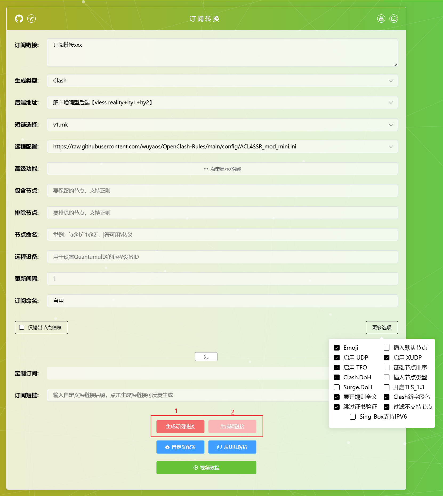

# OpenClash-Rules

# 订阅转换教程

***

## 快速使用

打开[肥羊订阅转换前端](https://suburl.v1.mk/)，填入必要信息（如图所示），用就完事了


***

### 1. 选择订阅转换服务器

> - 用别人搭建好的（因为前端一般不支持自定义后端故以下仅作前端推荐）
  [肥羊](https://sub.v1.mk)、[acl4ssr](https://acl4ssr-sub.github.io/)
> - 自行搭建: [前端项目sub-web-modify](https://github.com/youshandefeiyang/sub-web-modify) | [后端项目subconverter](https://github.com/tindy2013/subconverter)

***

### 2.订阅转换

> 以肥羊前端（https://sub.v1.mk ）为例，解释一下各个参数

> **2.1 订阅链接**  
> 
> > 顾名思义就是把要转换的订阅（必须直接包含节点信息，用已经转换过的放进去套娃是识别不到的哦）> 放进去，可放多个（每行一个或用"|"符号分隔）
> 
> **2.2 生成类型**
> 
> > a. clash：clash系和shadowrocket软件通用  
> > b. 混合订阅（mixed）：混合订阅的意思就是把各类型（包括Shadowsocks、V2ray、Trajon）的节> 点以纯节点信息然后base64加密的方式混在一起，V2ray系和shadowrocket都可用
> 
> **2.3 订阅转换**
> 
> > 点击后开始转换，转换完成后会自动下载转换后的订阅文件（clash格式）
> 
> **2.4 后端地址**
> 
> > 一般只能选提供的后端无法自定义，这里推荐选择肥羊的后端，长期使用下来兼容性和稳定性可以说都> 是最好的
> 
> **2.5 短链选择**
> 
>   > 转换后的订阅地址为后端地址加一系列参数，URL一般较长不甚美观，故可转为短链接  
>   > 自行搭建推荐: [YOURLS](https://github.com/YOURLS/YOURLS)
> 
> **2.6 远程配置**
> 
> > 分流配置，可以选择给定的也可以输入URL自定义分流规则（注意必须是直链才行），自用clash分流> 规则直链地址：https://raw.githubusercontent.com/wuyaos/OpenClash-Rules/main/config/ACL4SSR_mod_mini.ini
> 
> 
> **2.7 高级功能**
> 
> > 高级功能是可选的，可以不选，这里仅作介绍
> > 
> > a. 包含节点
> > 
> >   > * 节点黑名单，只有符合匹配规则的节点才会显示
> >   > 
> >   > * 常用规则
> >   >   
> >   >   * 只用香港节点: HK|香港|Hong Kong
> >   >   
> >   >   * 待补充
> > 
> > b. 排除节点
> >   
> >   > * 节点白名单，符合匹配规则的节点会被筛掉
> >   > 
> >   > * 常用规则
> >   >   
> >   >   * 将官网信息节点和流量信息节点筛掉: 官网|流量
> >   >   
> >   >   * 待补充
> > 
> > c. 节点命名
> >   
> >   > 节点按照一定规则重命名
> > 
> > d. 远程设备
> >   
> >   > 似乎是给QX用的，没用过QX不太清楚
> > 
> > e. 更新间隔
> >   
> >   > 顾名思义
> > 
> > f. 订阅命名
> >   
> >   >  订阅名称，在Clash for Windows一般会显示，其他客户端大多都为自定义
> > 
> > g. 更多选项（右下角）
> >   
> >   > * Emoji: 默认开启
> >   > 
> >   > * 启动UDP: 推荐开启，代理打游戏、打电话时大概率会用到，当然节点也得支持UDP开了才有用
> >   > 
> >   > * 启动TFO: 推荐开启
> >   > 
> >   > * 待补充

### 3. clash软件

***

> 推荐使用
> - [Clash Verge](https://github.com/clash-verge-rev/clash-verge-rev)
> - [mihomo-party](https://github.com/mihomo-party-org/mihomo-party)

***

### 4. FlClash 脚本（基于本仓库规则自动生成）

仓库内已提供 FlClash 可用的 `main(config)` 脚本生成链路，参考了 `ZipZhu/Flclash-scripts` 的脚本形态，并对接当前项目的 `config/*.ini` 规则源。

#### 4.1 文件说明

- `scripts/gen-flclash-scripts.js`：生成器，读取 `config/ACL4SSR_mod_mini.ini` 与 `config/Home_mod_mini.ini`
- `scripts/flclash.acl.js`：对应 `ACL4SSR_mod_mini.ini` 的 FlClash 脚本
- `scripts/flclash.home.js`：对应 `Home_mod_mini.ini` 的 FlClash 脚本

#### 4.2 重新生成

在项目根目录执行：

```bash
node scripts/gen-flclash-scripts.js
```

可选语法检查：

```bash
node -c scripts/gen-flclash-scripts.js
node -c scripts/flclash.acl.js
node -c scripts/flclash.home.js
```

#### 4.3 脚本能力范围

- 自动将 `custom_proxy_group` 转换为 FlClash 的 `proxy-groups`
- 自动将 `ruleset=` 转换为 `rule-providers` 与 `rules`
- 支持三类 `ruleset` 源：
  - 普通 URL（text provider）
  - `clash-classic:<url>`（yaml provider）
  - `[]GEOIP,...` / `[]FINAL`（内建规则，`FINAL` 转为 `MATCH,...`）
- 自动去重（provider 与 rules）并保持首次出现顺序
- 保留 `home` 与 `acl` 的差异（例如 `🏠 回家` 规则链）

#### 4.4 在 FlClash 中使用

1. 打开 FlClash 的脚本配置（YAML 脚本模式）。
2. 将 `scripts/flclash.acl.js` 或 `scripts/flclash.home.js` 内容粘贴进去。
3. 应用配置并重载核心，检查 `proxy-groups` 和 `rules` 是否按预期出现。

***

### 5. sing-box 配置示例（新增）

仓库提供了 sing-box 配置与转换脚本：

- `sing-box/config.example.json`
- `scripts/gen-singbox-rule-sets.js`
- `scripts/convert-clash-yaml-to-singbox.js`

当前流程是“先把本项目 `.list` 规则转为 sing-box source 规则，再按 `clash/mobile-module.yaml` 的规则顺序生成 sing-box JSON”。

生成后的 `config.example.json` 特点：

- `tun` 入站（全局接管）
- `selector + urltest` 出站（手动/自动切换）
- `route.rule_set` 全部为远程路径（`raw.githubusercontent.com/wuyaos/OpenClash-Rules/main/sing-box/rule-set/*.json`）
- `route.rules` 仅使用本项目规则，顺序对齐 `clash/mobile-module.yaml` 中对应的项目规则顺序

使用方式：

1. 生成本项目的 sing-box 规则集 JSON：

```bash
node scripts/gen-singbox-rule-sets.js
```

2. 从 Clash YAML 生成 sing-box JSON（默认输入 `clash/mobile-module.yaml`，默认输出 `sing-box/config.example.json`）：

```bash
node scripts/convert-clash-yaml-to-singbox.js
```

3. 把 `node-01` / `node-02` 改成你的真实节点（或改成你订阅导入后的节点 tag）。

关于“去广告有没有优势”：

- 有优势：可减少广告/追踪域名请求，页面更干净、部分场景更省流量。
- 也有代价：可能误拦截个别网站的登录、验证码、评论或视频资源域名。
- 建议做法：先启用当前示例里的 `oc-android-block` 与 `oc-awavenue-ads`，若遇到误拦截，再在 `route.rules` 前面增加白名单直连规则。
